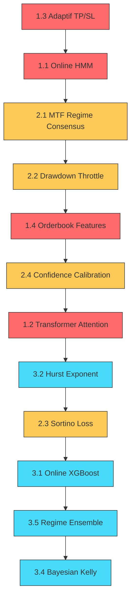

# 🚀 Scalp2 İleri Seviye İyileştirme Planı

Mevcut sisteminizi baştan sona inceledim. Aşağıda, profesyonel quant fonlarının, hedge fund'ların ve market maker'ların kullandığı teknikleri mevcut mimarinize entegre etmek için **öncelik sırasına göre** kapsamlı bir plan sunuyorum.

> [!NOTE]
> Her bölüm bağımsız uygulanabilir. Öncelik sırası tahmini etki/effort oranına göre belirlenmiştir. Kullanıcı onayından sonra seçilen modüller sırayla implemente edilecektir.

---

## 📊 Mevcut Sistemin Durumu

| Katman | Mevcut | Güçlü Yanlar | Eksikler |
|--------|--------|--------------|----------|
| **Features** | ~80-120 sütun (teknik, wavelet, orderflow, SMC) | Geniş kapsam, stationarity dikkati | Microstructure features yok, order book yok |
| **Model** | TCN+GRU → XGBoost meta-learner (~315K param) | İki aşamalı hybrid, latent extraction | Attention yok, transformer yok, online learning yok |
| **Regime** | 3-state Gaussian HMM | Forward-only inference | Statik, kendini güncelleyemiyor |
| **Execution** | 10-step filter cascade → partial TP + trailing | Sağlam filtre zinciri | Adaptif TP/SL yok, volatility-scaled sizing yok |
| **Risk** | Günlük limit, regime gate, MDD tracking | Temel korumalar mevcut | Korelasyon, drawdown-based throttle yok |

---

## 🔥 Öncelik 1: En Yüksek Etkili İyileştirmeler

### 1.1. Adaptif Rejim Filtresi — Online HMM Update

**Problem**: HMM eğitimden sonra donuyor. Piyasa yapısı değişince (yeni volatilite rejimi) HMM eski kalıplarla karar veriyor.

**Çözüm**: Bayesian Online HMM update — her yeni bar geldiğinde HMM'in transition matrix'ini ve emission parametrelerini **incremental** olarak güncelle.

**Teknik**: 
- Exponential decay ile eski verilerin ağırlığını azalt
- Sufficient statistics'i online olarak biriktir
- Her N barda (örn. 96 bar = 1 gün) HMM parametrelerini re-estimate et

**Etki**: Choppy'de kalma süresi azalır, rejim değişikliklerine daha hızlı tepki verilir

#### [MODIFY] [hmm.py](file:///c:/Users/Umut/Documents/PlatformIO/Projects/Scalp2/scalp2/regime/hmm.py)
- `update_online(new_data)` metodu ekle
- Exponential decay sufficient statistics tracking
- Transition matrix smooth update

---

### 1.2. Transformer Attention Mekanizması

**Problem**: TCN+GRU mimarisi lokal paternleri ve sequential dependencies'i iyi yakalar ama **uzun menzilli cross-bar ilişkileri** kaçırır. Örneğin 30 bar önceki bir support seviyesinin bugünkü relevance'ı.

**Çözüm**: Multi-Head Self-Attention katmanı ekle (TCN+GRU çıktısından sonra, fusion'dan önce).

**Teknik**:
- Positional encoding (sinusoidal veya learned)
- 4-head attention, d_model=192 (TCN+GRU concat boyutu)
- Causal mask (gelecek barları görmesin)
- Parametre artışı: ~50K (mevcut 315K'ya eklenir)

#### [MODIFY] [hybrid.py](file:///c:/Users/Umut/Documents/PlatformIO/Projects/Scalp2/scalp2/models/hybrid.py)
- `SelfAttentionBlock` sınıfı ekle
- HybridEncoder'a attention katmanını entegre et
- Forward pass: TCN+GRU → concat → Attention → projection

---

### 1.3. Volatilite-Adaptif TP/SL & Position Sizing

**Problem**: TP/SL çarpanları (`full_tp_atr: 2.0`, `sl_multiplier: 0.8`) statik. Düşük volatilitede çok agresif, yüksek volatilitede yetersiz kalabilir.

**Çözüm**: ATR percentile ve rejime göre dinamik TP/SL ayarlama.

**Teknik**:
```
if atr_percentile > 0.80:     # Yüksek volatilite
    tp_mult *= 1.3             # Daha geniş hedef
    sl_mult *= 1.2             # Biraz genişlet
elif atr_percentile < 0.30:   # Düşük volatilite
    tp_mult *= 0.7             # Sıkılaştır
    sl_mult *= 0.8
```

#### [MODIFY] [signal_generator.py](file:///c:/Users/Umut/Documents/PlatformIO/Projects/Scalp2/scalp2/execution/signal_generator.py)
- `_adaptive_tp_sl()` metodu ekle
- ATR percentile ve rejime göre TP/SL multiplier'ları dinamik yap

#### [MODIFY] [config.yaml](file:///c:/Users/Umut/Documents/PlatformIO/Projects/Scalp2/config.yaml)
- `adaptive_tp_sl` config bloğu ekle

---

### 1.4. Liquidation Heatmap / Orderbook Depth Features

**Problem**: Mevcut orderflow sadece CVD proxy (OHLCV bazlı tahmin). Gerçek order book derinliği ve likidite seviyelerini görmüyor.

**Çözüm**: Binance API'den gerçek zamanlı orderbook snapshot'ları al ve microstructure features üret.

**Yeni Features**:
- **Bid-ask imbalance**: [(bid_volume - ask_volume) / (bid_volume + ask_volume)](file:///c:/Users/Umut/Documents/PlatformIO/Projects/Scalp2/scalp2/regime/hmm.py#70-135) — en güçlü kısa vadeli yön göstergesi
- **Depth ratio**: Top 5-10-20 level bid/ask oranı
- **Spread z-score**: Mevcut spread'in N-bar ortalamasına göre konumu
- **Large order detection**: Belirli eşiğin üzerindeki emirler

#### [NEW] [microstructure.py](file:///c:/Users/Umut/Documents/PlatformIO/Projects/Scalp2/scalp2/features/microstructure.py)
- Orderbook snapshot processing
- Bid-ask imbalance hesaplama
- Depth ratio features

#### [MODIFY] [exchange.py](file:///c:/Users/Umut/Documents/PlatformIO/Projects/Scalp2/scalp2/live/exchange.py)
- `fetch_orderbook()` async metodu ekle

#### [MODIFY] [data_pipeline.py](file:///c:/Users/Umut/Documents/PlatformIO/Projects/Scalp2/scalp2/live/data_pipeline.py)
- Orderbook features'ı pipeline'a entegre et

---

## 🔶 Öncelik 2: Orta Etkili İyileştirmeler

### 2.1. Multi-Timeframe Regime Consensus

**Problem**: Rejim sadece 15m timeframe'den belirleniyor. 1H veya 4H'de bull olan bir piyasa 15m'de choppy görünebilir (ör. pullback sırasında).

**Çözüm**: Her MTF'de ayrı rejim tespiti ve **consensus voting**.

**Teknik**:
```
regime_15m = "choppy"  (prob=0.60)
regime_1h  = "bull"    (prob=0.75)
regime_4h  = "bull"    (prob=0.80)
→ Weighted consensus: 0.5*choppy + 0.3*bull + 0.2*bull = mixed
→ Trade izni: evet (üst TF'ler destekliyor)
```

#### [MODIFY] [hmm.py](file:///c:/Users/Umut/Documents/PlatformIO/Projects/Scalp2/scalp2/regime/hmm.py)
- `multi_tf_consensus()` metodu
- Weighted voting sistemi

#### [MODIFY] [signal_generator.py](file:///c:/Users/Umut/Documents/PlatformIO/Projects/Scalp2/scalp2/execution/signal_generator.py)
- Choppy check'i MTF consensus ile değiştir

---

### 2.2. Drawdown-Based Dynamic Throttle

**Problem**: Risk yönetimi statik. Günde 12 işlem limiti var ama art arda kayıp sırasında bot yavaşlamıyor.

**Çözüm**: Kayıp serisine göre otomatik agresivite azaltma.

**Kurallar**:
| Durum | Aksiyon |
|-------|---------|
| 2 ard arda kayıp | Confidence threshold'u +5% yükselt |
| 3 ard arda kayıp | Position size'ı %50 azalt |
| Günlük PnL < -2% | O gün trade durdur |
| Haftalık MDD > 5% | 24 saat cooldown |

#### [MODIFY] [risk_manager.py](file:///c:/Users/Umut/Documents/PlatformIO/Projects/Scalp2/scalp2/execution/risk_manager.py)
- Streak tracking
- Dynamic confidence/sizing adjustment
- MDD-based cooldown

---

### 2.3. Reinforcement Learning Reward Shaping — Calmar/Sortino Loss

**Problem**: Mevcut loss fonksiyonu CE + Sharpe. Sharpe aşağı yönlü riski yeterince cezalandırmıyor (symmetric std kullanıyor).

**Çözüm**: Sortino ratio bazlı loss (sadece downside deviation), opsiyonel olarak Calmar ratio (return/MDD).

#### [NEW] [sortino_loss.py](file:///c:/Users/Umut/Documents/PlatformIO/Projects/Scalp2/scalp2/losses/sortino_loss.py)
- Differentiable Sortino loss
- Downside-only deviation hesaplaması

---

### 2.4. Confidence Calibration — Platt Scaling

**Problem**: XGBoost'un olasılık çıktıları well-calibrated olmayabilir. %55 dediğinde gerçekten %55 mi?

**Çözüm**: Post-hoc calibration (Platt scaling veya isotonic regression) ile olasılıkları kalibre et.

**Teknik**: Validation set üzerinde calibration curve çıkar, LogisticRegression ile prob'ları düzelt.

#### [MODIFY] [meta_learner.py](file:///c:/Users/Umut/Documents/PlatformIO/Projects/Scalp2/scalp2/models/meta_learner.py)
- `calibrate(val_probs, val_labels)` metodu
- `predict_proba_calibrated()` metodu

---

## 🔷 Öncelik 3: İleri Seviye İyileştirmeler

### 3.1. Online Learning — Incremental XGBoost Update

**Problem**: XGBoost modeli haftalık yeniden eğitim bekliyor. Bu arada piyasa yapısı kayabilir (concept drift).

**Çözüm**: Son 7 günün verisiyle XGBoost'u **incremental** olarak güncelle (xgb_model parametreleriyle yeni ağaçlar ekle).

#### [MODIFY] [meta_learner.py](file:///c:/Users/Umut/Documents/PlatformIO/Projects/Scalp2/scalp2/models/meta_learner.py)
- `incremental_update(new_X, new_y)` metodu
- Eski model üzerine `n_estimators=50` ek ağaç

#### [MODIFY] [bot.py](file:///c:/Users/Umut/Documents/PlatformIO/Projects/Scalp2/scalp2/live/bot.py)
- Günlük otomatik model update döngüsü

---

### 3.2. Hurst Exponent & Fractal Analysis

**Problem**: Mevcut trend gücü sadece ADX ile ölçülüyor. ADX gecikmeli bir gösterge ve mean-reverting vs. trending ayrımını iyi yapamaz.

**Çözüm**: Hurst Exponent — piyasanın **trending (H>0.5)**, **mean-reverting (H<0.5)** veya **random walk (H≈0.5)** olduğunu belirler.

**Yeni Features**:
- Rolling Hurst exponent (R/S analizi, 64-bar pencere)
- Hurst z-score (normal range'den sapma)
- Fractal dimension (1/H)

#### [NEW] [fractal.py](file:///c:/Users/Umut/Documents/PlatformIO/Projects/Scalp2/scalp2/features/fractal.py)
- R/S analizi ile Hurst exponent
- Rolling fractal dimension

---

### 3.3. Multi-Exchange Spread Arbitrage Signals

**Problem**: Sadece Binance futures verisi kullanılıyor. Cross-exchange price divergence önemli bir sinyal.

**Çözüm**: Coinbase/Bybit spot vs Binance futures arası premium/discount'ı feature olarak ekle.

#### [NEW] [cross_exchange.py](file:///c:/Users/Umut/Documents/PlatformIO/Projects/Scalp2/scalp2/features/cross_exchange.py)
- Spot-futures basis hesaplama
- Cross-exchange premium z-score

---

### 3.4. Bayesian Position Sizing (Kelly Upgrade)

**Problem**: Mevcut Kelly formülü statik `p` (confidence) ve `b` (payoff ratio) kullanıyor. Gerçekte bunların uncertainty'si var.

**Çözüm**: Bayesian Kelly — confidence'ın kendisinin de bir uncertainty'si olduğunu modelle. Belirsiz olduğunda daha az pozisyon al.

#### [MODIFY] [signal_generator.py](file:///c:/Users/Umut/Documents/PlatformIO/Projects/Scalp2/scalp2/execution/signal_generator.py)
- `_bayesian_kelly_size()` metodu
- Entropy-based uncertainty scaling

---

### 3.5. Regime-Specific Model Ensemble

**Problem**: Tek bir XGBoost tüm rejimlerde tahmin yapıyor. Bull piyasada öğrenilen paternler bear piyasada geçerli olmayabilir.

**Çözüm**: Rejim başına ayrı XGBoost modeli eğit, live'da aktif rejime göre ilgili modeli çağır.

#### [MODIFY] [meta_learner.py](file:///c:/Users/Umut/Documents/PlatformIO/Projects/Scalp2/scalp2/models/meta_learner.py)
- `RegimeEnsemble` sınıfı — 3 ayrı XGBoost (bull/bear/choppy)
- Rejim olasılıklarıyla weighted prediction

---

## 🔧 Öncelik 4: Altyapı & Operasyonel İyileştirmeler

### 4.1. Performance Dashboard & Trade Analytics

**Çözüm**: Streamlit/Gradio bazlı local dashboard — live PnL, regime distribution, confidence calibration, feature importance.

#### [NEW] [dashboard.py](file:///c:/Users/Umut/Documents/PlatformIO/Projects/Scalp2/scalp2/analysis/dashboard.py)

---

### 4.2. A/B Testing Framework

**Çözüm**: Paper mode'da iki farklı config veya model versiyonunu paralel çalıştır, karşılaştır.

#### [NEW] [ab_tester.py](file:///c:/Users/Umut/Documents/PlatformIO/Projects/Scalp2/scalp2/analysis/ab_tester.py)

---

### 4.3. Alert System Geliştirme

**Çözüm**: Choppy→trend geçişi, anormal hacim spike'ı, funding rate anomalisi gibi durumlar için proaktif alertler.

#### [MODIFY] [notifier.py](file:///c:/Users/Umut/Documents/PlatformIO/Projects/Scalp2/scalp2/live/notifier.py)
- `regime_change_alert()`, `volume_anomaly_alert()`, `funding_anomaly_alert()`

---

## 📋 Uygulama Sıralaması Önerisi



> 🔴 Kırmızı = Yüksek öncelik &nbsp; 🟡 Sarı = Orta &nbsp; 🔵 Mavi = İleri seviye

---

## User Review Required

> [!IMPORTANT]
> **Hangi iyileştirmelerden başlamak istiyorsunuz?** Tüm listeyi sırayla yapabiliriz veya belirli modülleri seçebilirsiniz. Önerilen başlangıç noktası:
> 1. **1.3 Adaptif TP/SL** (en kolay, en hızlı etki)
> 2. **1.1 Online HMM** (choppy sorununu doğrudan çözer)
> 3. **2.2 Drawdown Throttle** (risk koruması)

> [!WARNING]
> **1.2 Transformer Attention** ve **3.5 Regime Ensemble** gibi model mimarisi değişiklikleri, modelin tamamen yeniden eğitilmesini gerektirir. Bu, backtest sonuçlarını etkileyebilir ve dikkatli A/B test gerektirir.

## Verification Plan

Seçilen her modül için:

### Automated Tests
- Mevcut test suite: [tests/test_features.py](file:///c:/Users/Umut/Documents/PlatformIO/Projects/Scalp2/tests/test_features.py), [tests/test_models.py](file:///c:/Users/Umut/Documents/PlatformIO/Projects/Scalp2/tests/test_models.py), [tests/test_signal.py](file:///c:/Users/Umut/Documents/PlatformIO/Projects/Scalp2/tests/test_signal.py), [tests/test_labeling.py](file:///c:/Users/Umut/Documents/PlatformIO/Projects/Scalp2/tests/test_labeling.py), [tests/test_walk_forward.py](file:///c:/Users/Umut/Documents/PlatformIO/Projects/Scalp2/tests/test_walk_forward.py)
- Her yeni modül için unit test yazılacak
- Backtester üzerinden tam walk-forward test ile öncesi/sonrası PnL karşılaştırması
- Komut: `python -m pytest tests/ -v`

### Manual Verification
- Paper mode'da 24-48 saat canlı test
- Telegram loglarından rejim geçiş süreleri ve sinyal kalitesinin karşılaştırması
